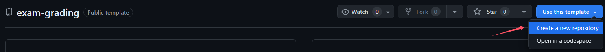

# Exam Grading

用于基础阶段的自动测试评分系统

## InfiniTensor训练营（2024夏季）

基础阶段学员可选择 [Rust基础](https://opencamp.cn/InfiniTensor/camp/2024summer/stage/2) 或 [C++基础](https://opencamp.cn/InfiniTensor/camp/2024summer/stage/1) 进行，阶段及格与否通过本仓库对阶段习题进行评测，导学阶段请学员通过本模板仓库创建自己的exam-grading仓库：



基础阶段完成一个方向的习题并全部通过即阶段及格晋级下一阶段，我们鼓励学员尝试完成Rust和C++的习题。若在过程中有任何问题都可以联系助教。

## 使用指南

1. 克隆仓库

    ```bash
    git clone <your-exam-grading-github-addr> ./exam-grading
    cd exam-grading
    ```

2. 添加测试目录

    可选择通过子目录或直接目录来进行测试，这里推荐以子目录方式添加：

    ```bash
    # 添加子模块
    git submodule add <your-submodule-github-addr> ./exams
    ```

    使用直接目录：

    ```bash
    # 克隆仓库到./exams
    git clone <your-repo-github-addr> ./exams
    ```

3. 运行测试

    i. 当完成部分或所有练习后，记得更新自己的rustlings或learning-cxx目录

    ```bash
    # 使用子模块：
    git submodule update --remote
    # 使用直接目录：
    cd rustlings
    git pull
    ```

    ii. 之后提交到远程仓库，评测结果可以在Github仓库的actions页面中查看，或者 [Ranking](https://) 上面查看自己的评分排名（更新会有延迟）。

## 其它

- [Git子模块](https://git-scm.com/book/zh/v2/Git-%E5%B7%A5%E5%85%B7-%E5%AD%90%E6%A8%A1%E5%9D%97)
- [InfiniTensor训练营导学阶段指导书](https://17999824wyj.github.io/InfiniTensor-camp-book-stage0/)
